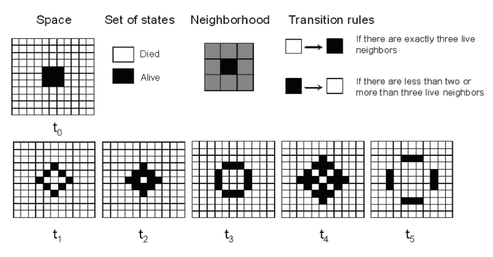
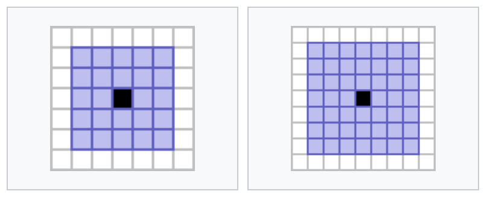
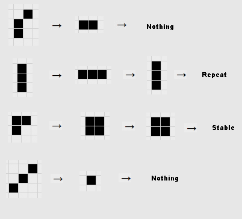
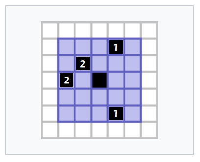

# Homework: Game Of Life

**Welcome to the world of the Game of Life!**

In this assignment, you will build your own games in C++ using our framework. This will be a challenging but rewarding experience. 

Have fun!

## Background

[**The Game of Life**](https://en.wikipedia.org/wiki/Conway%27s_Game_of_Life) is a simple but profound game, created by one of the world greatest mathematician John Horton Conway. This game does not require player participation because all evolutionary processes are determined by the initial state and will proceed spontaneously. A common way to play with the Game of Life is to give it an initial state and watch how it evolves.


## Rules

The universe of the Game of Life can be simply considered as an infinite sheet of grid paper, in which each grid (or cell) is either alive or dead. The [original rules for the Game of Life](https://en.wikipedia.org/wiki/Conway's_Game_of_Life#Rules) are reprinted below:

- **Underpopulation:** Any living cell with fewer than two living neighbors (the surrounding 8 cells) dies.

- **Survive:** Any living cell with two or three living neighbors lives on to the next generation.
- **Overpopulation:** Any living cell with more than three living neighbors dies.
- **Reborn:** Any dead cell with exactly 3 living neighbors comes to life.



There are many [variants of the Game of Life](https://en.wikipedia.org/wiki/Conway%27s_Game_of_Life#Variations) , each with its own rules. Here are four of the most popular variants:

- **Colorised**

  It follows the basic rules as described above with one addition: the living cells have different colors. When a cell is born, its color will be decided by the major color of its three living neighbors.

  The formal definition will be described later. More on [wiki](https://conwaylife.com/wiki/Colourised_Life).

- **Extended**

  It follows the basic rules as described above with one change: the size of a cell's neighborhood is extended. Consider any square with size $2k+1$, the centering cell will have all other cells in this square as its neighbors. For example, extended to a 5 \* 5 square, (i.e all 24 cells around a cell are now its neighbors, but the cell itself is not included in its neighborhood).

  

  The formal definition will be described later. More on [wiki](https://conwaylife.com/wiki/Gallery_of_neighbourhoods/Images).

- **Weighted**

  It follows the **extended** rules as described above with one addition: the neighbors are weighted, meaning that some neighbors might have more influence on the centering cell. More on [wiki](https://conwaylife.com/forums/viewtopic.php?f=11&t=935)

- **Generations:**

  It follows the basic rules as described above with one change: the living cells will not die immediately when overpopulation or underpopulation happens. Instead, the cells 'get older' before the final death.

  The formal definition will be described later. More on [wiki](https://conwaylife.com/wiki/Generations).

## Try it Out!

The Game of Life has been studied extensively, and many interesting patterns have been discovered. Before starting your work, we strongly recommend you to first try this game out! You can play with it at [golly](https://golly.sourceforge.net/webapp/golly.html), and there are many amazing patterns you can find online. Here is a video in [YouTube](https://www.youtube.com/watch?v=C2vgICfQawE) and [BiliBili](https://www.bilibili.com/video/BV1PE411d7aR) about the Game of Life for your reference.

You will notice that some of the patterns are stable, meaning that they will continue to exist indefinitely, and some of them are even periodic, meaning that they will repeat themselves after a certain number of steps. Other patterns are unstable, meaning that they will eventually die out. Here are some basic patterns:

 

## Your Task

The Game of Life is a very simple game, but it has been shown to be capable of producing complex and interesting patterns. In fact, there are entire websites and books dedicated to the study of the Game of Life.

Your task is to complete the implementation of our C++ version of the Game of Life with multiple rules. We have provided you a framework to help you get started. You need to design the variant game rules in `LifeRule.h` and `LifeRule.cpp`. You can refer to [How-to-Run](#how-to-run) to play with the game.

Different rules are represented by different classes that inherit on the common base rule `class LifeRuleBase`. You need to think about how to design these class structures, and the inheritance relationship between different rules.

We have already provided the base rule, `class LifeRuleBase`. Left you to finish are four variant rules listed above: `LifeRuleColorised`, `LifeRuleExtended`, `LifeRuleWeighted`, and `LifeRuleGenerations`.

Here is the description:

- `LifeRuleBase`: We have provided it for you. This is the original Game of Life, containing the basic code for implementing a rule in the Game of Life.
- `LifeRuleColorised`: **You need to complete it**. In this variant, the live cells have different colors.
- `LifeRuleExtended`: **You need to complete it**. In this variant, the size of a cell's neighborhood is extended.
- `LifeRuleWeighted`: **You need to complete it**. In this variant, neighbors are weighted.
- `LifeRuleGenerations`: **You need to complete it**. In this variant, the cells "get older" before eventually dying.

To make sure the homework compiles, every rule must be a subclass of `LifeRuleBase`. 

You will be working only on two files, `LifeRule.h` and `LifeRule.cpp`. Other files are not submitted.

### Framework

In real life, the game is often played on infinite number of grids. However, to simplify this homework, our game has fixed 25 \* 25 grids. The cells out of the grids will always be regarded as dead, and will never come to life.

For the original rules, a cell in grid can be described by three parameters: **x**, **y** and **state**:

- $(x, y)$ represents the coordinate of this cell. $(x, y \in Z^+, 0 \leq x, y \leq 24)$
- State describes whether the cell is alive or dead.

A cell is defined in `LifeCell.cpp`, called `class LifeCell`, with a smart pointer `CellPointer`.

A class of any rules have two key functions `DetermineNextState`, `GetNeighbors`. You may want to reuse some of them, and rewrite others.

Here is the definition of the two functions:

#### DetermineNextState

```cpp
void DetermineNextState(const CellPointer current, const CellNeighbors &neighbors) const
```

This function will determine the next state of a cell, based on its current state and the number of lived `neighbors`.

- **_Parameters:_**

  `current`: A `CellPointer`, pointing to a cell to be updated

  `neighbors`: an `std::vector` of `CellPointer`, containing all the neighbors of the cell we working on. You need to count the number of living cells in neighbors to determine the next state.

#### GetNeighbors

```cpp
CellNeighbors GetNeighbors(const GameWorld *const game_world, const int x, const int y) const
```

It returns a vector containing all of the neighbors of the cell at $(x, y)$ .

- **_Parameters:_**

  `game_world`: The current world we are working in (You can imagine this as the grid paper we play the game on).

  `x`,` y`: The coordinate of the cell.

- **_Returns:_**

  All neighbors of a cell at $(x, y)$ .

### Rules Implementation Guide

#### Colorised Rule

The colorised rule is a variant of the original game. Now the living cells are all colored with one of the two different colors, red and blue. When a cell is born, its color will be decided by the majority color of its three lived neighbors.

Since the birth of a cell only happens when it has 3 living neighbors, and we only have 2 colors here, a majority color is guaranteed.

- Please note that it should be implemented as `class LifeRuleColorised`.

##### Hint

- You may want to inherit `LifeRuleBase` and override its `DetermineNextState`.

#### Extended Rule

The extended rule is a variant of the original game, where a cell's neighborhood is extended to 2. (i.e. All other 24 cells in a square of size $5 * 5$ are now neighbors of the centering cell).

- Please note that it should be implemented as `class LifeRuleExtended`.

##### Hint

- This can be done by overriding `GetNeighbors`.

#### Weighted Rule

The weighted life rule is a variant of our extended game. Now the living cells are all weighted, meaning that some neighbors might have greater influence.

First, let's define the _total influence_ of a cell. This shows how much influence a cell receives from its neighbors in all. In our rules, each neighbor's weight **relative** to $x$ can be represented as the matrix below:

$$ \begin{matrix} 1 & 1 & 2& 1& 1\\ 1 & 2 & 2& 2& 1\\ 2 & 2 & x& 2& 2 \\ 1 & 2 & 2& 2& 1 \\ 1 & 1 & 2& 1& 1\end{matrix}\tag{2}$$

Then, knowing every neighbor's _weight_ ($W$) and _state_ ($S$, dead for 0 and live for 1), the _total influence_ ($F$) of a cell can be computed with the equation:

$$ F*x = \sum\limits_{y}W_y \cdot S_y, \text{ for all y in x's neighborhood} $$

So in detail, what you should do is:

1. For a cell, calculate the sum of the weights of its neighbors. We call this _total influence_.
2. **Underpopulation:** Any cells with a _total influence_ $<4$ dies.
3. **Survive:** Any living cell with $4 \leq $ _total influence_ $\leq 6 $ survives.
4. **Overpopulation:** Any cells with a _total influence_ $>6$ dies.
5. **Reborn:** Any dead cell with $5 \leq$ _total influence_ $\leq 6 $ becomes alive.

For example, the cell in the center of the following grid has a _total influence_ of 6, so it will survive in the next generation.



##### Hint

This can be done by overriding `DetermineNextState` in `LifeRuleExtended`.

#### Generations Rule

The generations rule is a variant of the original game. Now the living cells will not die immediately when overpopulation or underpopulation happens. Instead, the cells 'get older' before the final death.

The detailed rules are as follows:

1.  A cell in state 0 ("dead") will switch to state 1 ("born") in the next state if it has exactly 3 neighbors that is **not** in state 0 ("dead").
2.  A cell in state 1 ("alive") will:

    - Remain in state 1 ("survive") in the next state if it has 2 or 3 neighbors **not** in state 0 ("dead").
    - Otherwise, switch to state 2 ("aging") in the next state.

3.  A cell in state $m \geq 2$ will switch to state $m + 1$ in the next state. In particular, a cell in state $N$ will be reset to state 0 ("die"). Which means that the state of a cell should always be in the range $[0, N)$ and can **never** be $N$ .

In this homework, $N = 8$ .

- Please note that it should be implemented as `class LifeRuleGenerations`.

##### Hint

You may want to inherit `LifeRuleBase` and override its `DetermineNextState`.

### Cell state and map representation

#### Cell State

The cell class `LifeCell` is defined in `LifeCell.cpp`. It has three attributes: **x**, **y** and **state**. However, to support different rules, the state is **not** binary (just 'dead' or 'alive'), but an integer state. The state of a cell can be one of the following:

- 0: dead
- 1: alive
- 2: red (colorised rule)
- 3: blue (colorised rule)

Or the state can be the generation of the cell in generations rule, in which case it can be any integer from 0 to 7.

Your implementation of the rules should be able to handle the state transition within the range, it is guaranteed in all test cases that:

- The state of a cell will never be negative.
- In the base rules, extended rules and weighted rules, the state of a cell will only be 0 or 1.
- In the colorised rule, the state of a cell will only be 0, 2 or 3.
- In the generations rule, the state of a cell will only be integers from 0 to 7.

#### Map File

Our game world can be represented by a map file. In our homework, we use a simple `.cells` file to store the initial state of the game.

We provide some example files in the `map` folder, you can refer to [How-to-Run](#how-to-run) to see how to load the map file.

You don't need to load the map by yourself, our framework have already implemented the map loading function. In case you want to edit the map file, here is a brief introduction of the file format:

The file format is similar to [plain text format](https://conwaylife.com/wiki/Plaintext) for simpilicity. However, to support different rules, we have made some changes to the file format.

> ##### Notice: This part can be ignored if you don't want to edit the map file.
>
> ###### Comments start with a '!' and are ignored
>
> ###### Cells are represented by a 'O' or '.' (alive or dead respectively)
>
> ###### 'R' and 'B' represent red and blue cells in colorised rule (it is ignored in other rules, and not supported officially by golly).
>
> ###### Numbers represent the generation of the cell in generations rule (it is ignored in other rules, and not supported officially by golly).

### How to run

#### Compile the project

In Windows, you can compile with:

```bash
g++ -Wall -Wextra -o gol.exe GameWorld.cpp GameManager.cpp LifeCell.cpp main.cpp LifeRule.cpp
```

In Linux or MacOS, you can compile with:

```bash
g++ -Wall -Wextra -o gol GameWorld.cpp GameManager.cpp LifeCell.cpp main.cpp LifeRule.cpp
```

The framework we provide does not compile right off-hand, because the four `class`es of life rules for you to write haven't inherited from `LifeRuleBase` yet. Try to make these `class`es inherit from `LifeRuleBase`, and you can compile your code to run the already implemented base game.

#### Run the project

```bash
./gol <rule>
```

The program takes one argument, which is the rule you want to use. The rule can be `Base`, `Colorised`, `Extended`, `Weighted`, `Generations`.

Try to run with `./gol base` and you can play with the original Game of Life.

Then, you can select a map from `map/` and play with it. We have provided different maps for different rules.

For example, after you have implemented `LifeRuleColorised`, you can run with `./gol colorised`, then load the map 'map/colorised.cells'.

You can find more maps at the [wiki](https://conwaylife.com/wiki/) and play with them at [golly](https://golly.sourceforge.net/webapp/golly.html).

### File Structure

This problem contains several files. You may need to read and understand some of them in order to complete the assignment. There are also some files that you can simply ignore. **You don't need to understand every line to finish this homework**.

#### Files you'll edit:

| Filename                     | Description                                                                                                             |
| ---------------------------- | ----------------------------------------------------------------------------------------------------------------------- |
| `LifeRule.h`, `LifeRule.cpp` | Where all of your rules will reside. You need to implement the rules in these files. You only need to submit these files. |

#### Files you might want to look at:

| Filename                                   | Description                                                                                                                   |
| ------------------------------------------ | ----------------------------------------------------------------------------------------------------------------------------- |
| `LifeCell.h`, `LifeCell.cpp`               | The cell class, representing a cell in a grid in the game world.                                                              |
| `GameWorld.h`, `GameWorld.cpp`             | It contains the game world class, which maintains all the cells in the game world.                                            |
| `main.cpp`                                 | The main file that runs the game. This file defined a game instance and build up a interface.                                 |
| `GameSettings.h`                           | The file that defines some basic game settings as described above. You may want to use these settings in your implementation. |
| `map/base.cells`, `map/colorised.cells`... | The map files for different rules. You can load them in the game.                                                             |

#### Supporting files you can ignore:

| Filename                           | Description                                      |
| ---------------------------------- | ------------------------------------------------ |
| `utils.h`                          | Useful functions for implementing the interface. |
| `GameManager.cpp`, `GameManager.h` | Simple ASCII graphics for the game               |

## Submission

You need to pack `LifeRule.h` and `LifeRule.cpp` into a zip file and submit it to OJ.

The zip file can have an arbitrary name, but should only contain these two files. For MacOS users, it is fine to have one additional system-generated file named `.DS_Store`.

In Linux or MacOS, you can run the following command to pack the files:

```bash
zip -r submit.zip LifeRule.h LifeRule.cpp
```

In Windows, you can use [7-zip](https://www.7-zip.org/) or [BandiZip](http://www.bandisoft.com/) to pack the files, or use the following command:

```bash
tar.exe -a -c -f submit.zip LifeRule.h LifeRule.cpp 
```


## Appendix: How to work around with multiple files in C++

If you are not familiar with terminal, please refer to [Learn how to use terminal](https://sp18.datastructur.es/materials/lab/lab1setup/lab1setup#b-learn-to-use-the-terminal).

It is hard to maintain a large project within a single file. Splitting your program into multiple small files makes it easier to understand and work with. Each file can focus on one specific task. This is less overwhelming than putting everything in one huge file.

In this homework, you will practice how to write multiple files and how to use them together.

In previous homeworks, you have written C++ programs in a single source file (`*.c`, `*.cpp`). Some homework contain header files (`*.h`, `*.hpp`), which are `#include`d in source files and not passed directly to the compiling command. Recall that, to compile a single-file C++ program, we run:

```bash
g++ homework.cpp -o homework -Wall -Wextra 
```

`g++` is the GNU C++ compiler. The `-Wall` and `-Wextra` flags enable additional warning messages to catch issues in your code. `homework.cpp` is the file you are compiling. The `-o` flag specifies the name of the executable file, `homework` in this case,

To compile multiple `.cpp` files into a program, you can run with:

```bash
g++ circle.cpp square.cpp triangle.cpp -o shapes
```

This will compile `circle.cpp`, `square.cpp` and `triangle.cpp` into into an executable named `shapes`. If there are header files such as `circle.h` or `square.h`, as long as they are properly included, the code in them are also compiled.

When compiling multiple files, make sure to:

1. Include the proper header files in each `.cpp` file, for example:

```c++
#include "square.h"
```

2. Use include guards in your header files to avoid duplicate definitions, for example:

```cpp
// square.h
#ifndef SQUARE_H
#define SQUARE_H
// some code here
#endif
```

3. Declare functions in header files before implementing them in source files:

```cpp
// square.h
double calcSquareArea(double side);

// square.cpp
double calcSquareArea(double side) { ... }
```

4. Use relative or absolute paths to include headers

```cpp
#include "square.h"  // Relative to current file
#include <iostream> // Searches in standard library directories
```
