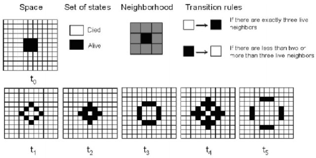

# Homework: Game Of Life

## Introduction

The Game of Life is a cellular automaton devised by the British mathematician John Horton Conway in 1970. It is a zero-player game, meaning that its evolution is determined by its initial state, requiring no further input. One interacts with the Game of Life by creating an initial configuration and observing how it evolves. It is Turing complete and can simulate a universal constructor or any other Turing machine.

The universe of the Game of Life is an infinite, two-dimensional orthogonal grid of square cells, each of which is in one of two possible states, live or dead (or populated and unpopulated, respectively). Every cell interacts with its eight neighbours, which are the cells that are horizontally, vertically, or diagonally adjacent. At each step in time, the following transitions occur:

* Any live cell with fewer than two live neighbours dies, as if by underpopulation.

* Any live cell with two or three live neighbours lives on to the next generation.
* Any live cell with more than three live neighbours dies, as if by overpopulation.
* Any dead cell with exactly three live neighbours comes to life.

The Game of Life has been studied extensively, and many interesting patterns have been discovered. Some of these patterns are stable, meaning that they will continue to exist indefinitely. Others are unstable, meaning that they will eventually die out. Still others are periodic, meaning that they will repeat themselves after a certain number of steps. Here are some basic patterns:

More amazing patterns can be found in the [wiki](conwaylife.com). You can also play with it at [golly](https://golly.sourceforge.net/webapp/golly.html). Here is a video in [youtube](https://www.youtube.com/watch?v=C2vgICfQawE) and [bilibili](https://www.bilibili.com/video/BV1PE411d7aR) about the Game of Life for your reference.

There are many variants of the Game of Life, each with its own set of rules.

* Colorised

    The base rules followed by the original Game of Life are the same as above.

    However, the live cells have different colors. When a cell is born, it takes on the colour value of the majority of its three neighbours.

    The formal definition will be describe later. More on [wiki](https://conwaylife.com/wiki/Colourised_Life).

* Extended

    The base rules followed by the original Game of Life are the same as above.

    However, the size of a cell's neighborhood is extended to include cells with a distance greater than one. 

* Weighted

    The size of a cell's neighborhood is extended to include cells with a distance greater than one. However, the closer neighbor makes more influence than distant one.

* Generations: 

    The live cells would not dead immediately when overpopulated or underpopulated. Instead, the cells 'get older' before eventually dying.
    
    The formal definition will be describe later. More on [wiki](https://conwaylife.com/wiki/Generations).

## Your Task

### Description

### How to run

### File Structure

The code for this project consists of several files, some of which you will need to read and understand in order to complete the assignment, and some of which you can ignore.

## Submission